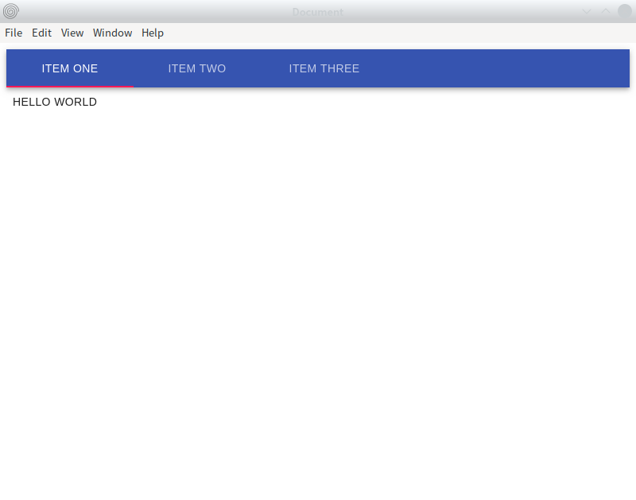
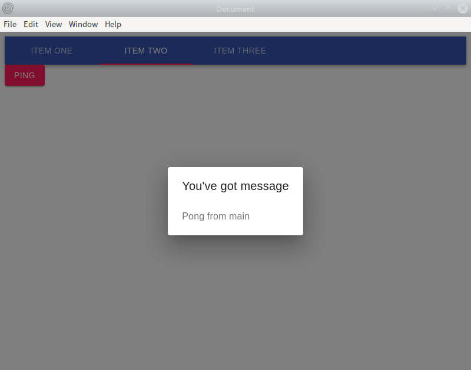
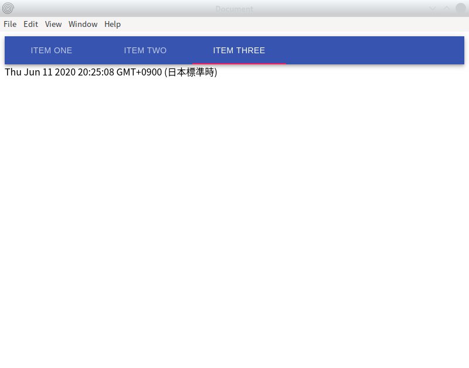

# electron-react-example

Examples of Electron application

## Overview

- Script Language: Typescript
- UI: Material-UI
- State management: Rxjs
- Linting: ESLint
- Bundling: Webpack
- Building: electron-builder

## NPM scripts

|Script|Description|
|----|----|
|dev|Bundle and launch the app in development configuration|
|bundle|Bundle the app in production configuration|
|start|Launch the app in production configuration|
|build|Build the app in production configuration|
|lint|Lint the source code|
|fix|Auto-fix the source code|

## Screenshots

